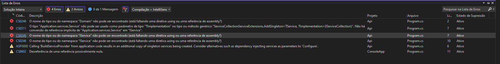

# Estudo da arquitetura hexagonal

## Resumo de artigo
### Fonte: Cockburn, Alistair (2005-04-01). "Hexagonal architecture"
  A intenção desta arquitetura é permitir que aplicações sejam igualmente conduzidas por usuários, programas, testes automatizados ou scripts batch e desenvolvida/testada de forma isolada de seus dispositivos e bancos de dados. Como motivação, Alistair menciona o problema da infiltração de lógica de negócios no código da interface do usuário descrevendo seus 3 desdobramentos: dificuldade de testes automatizados, inflexibilidade no uso (por exemplo mudar de um uso do sistema conduzido por humanos para um sistema batch) e impossibilidade de o programa ser conduzido por outros programas. Ele ressalta os benefícios do uso de APIs: QAs podem rodar testes automatizados, negócios podem criar casos de teste antes da GUI ser finalizada e o deploy pode ser feito apenas com a API pronta.

  Para entender a natureza da solução, devemos considerar a perspectiva “dentro” e “fora” da aplicação com a regra: o código relativo à parte de dentro não deve vazar para a parte de fora da aplicação.	Devemos pensar nas portas como em um sistema operacional onde qualquer dispositivo que adere aos protocolos da porta pode ser plugado (por exemplo fone USB). Para cada agente externo existe um adaptador que converte as informações. Uma interface gráfica GUI é um exemplo de adaptador que converte movimentos da pessoa para a API da porta. Na implementação, portas e adaptadores aparecem em dois tipos chamados: condutores (Driving) e acionados (Driven), além disso, os casos de uso geralmente devem ser escritos no limite da aplicação (o hexágono interno).

## Mapa Mental 


## Caso de Estudo 1 - Interagindo com a lógica de negócios de duas maneiras diferentes

Vamos considerar um problema simples: A soma de dois números inteiros! Por outro lado, vamos adicionar 2 "adaptadores condutores", ou seja, duas formas diferentes de interagir com o domínio: via API e console.

#### Passo a passo:

1) Criar entidades (Entity 1 e 2) contendo apenas uma propriedade;
2) Criar a porta para lógica de negócios (interface IService) que os "adaptadores condutores" vão usar para acessar;
3) Criar a classe concreta que implementa a lógica de negócios (Service);
4) Criar adaptadores e usar os serviços de negócios;

#### Hierarquia das dependências


#### Analogia


#### Uso de injeção de dependência nos adaptadores
Adicionalmente usamos injeção de dependência para diminuir o acoplamento entre os adaptadores e o serviço que implementa a lógica de negócios. Para usar seguimos esse passo a passo:

1) Instalar a dependência Microsoft.Extensions.DependencyInjection nos adaptadores;
2) Configurar os serviços:

```
  var serviceProvider = new ServiceCollection()
            .AddTransient<IServicoExemplo, ServicoExemplo>()
            .BuildServiceProvider();
```
3) Obter instância do serviço:

```
  var servico = serviceProvider.GetService<IServicoExemplo>();
```

### Questionamentos deste estudo

1) Ao usar a entidade na classe que implementa a lógica de negócios, devemos criar uma instância da entidade para ter acesso à sua propriedade. Está correto a implementação da lógica de negócios acessar as classes de entidade? Como usar a injeção e dependência para criar a instância da entidade?

## Caso de estudo 2 - Adicionando novo adaptador acionador (BD in memory) e induzindo mudança no domínio

Vamos começar induzindo uma mudança nas entidades de domínio, elas serão mescladas e existirá uma única entidade apenas. Dessa forma vamos nos atentar às mudanças causadas por essa modificação.

Ao excluir a "Entity2" induzimos erro na aplication e como os adaptadores dependem do serviço de negócios acusam erro também. Então efetuamos uma modificação na regra de negócio que usa as propriedades da entidade que foi excluída (arquivo Service no projeto application), porém ao recompilar continuamos com erros na program



Debuggando o projeto percebemos que usando o aplicativo de console é possível acessar a nova lógica de negócios e executar a operação normalmente, por tanto os erros estão no adaptador API.


Para corrigir basta excluir a linha do using apontando para o domain e adicionar novamente. Portanto, concluimos que se trata de um erro operacional do Visual studio. Dessa forma, é possível observar que ao mudarmos algo no domínio devemos ajustar apenas a lógica de negócios, constatando o isolamento entre a implementação dos adapters e da lógica de negócios com o domínio. 

Para adicionar o bd in memory siga esse passo a passo:
1) Adicionar a dependência Microsoft.EntityFrameworkCore.InMemory;
2) Criar a classe de contexto:

```
  public class ApplicationDbContext : DbContext
    {
        public DbSet<Entity1> Entity1 { get; set; }
  
        protected override void OnConfiguring(DbContextOptionsBuilder optionsBuilder)
        {
            optionsBuilder.UseInMemoryDatabase(databaseName: "SumNumsAb");
        }

    }
```
3) Adicionar uma anotação indicando o Id da tabela:

````
  [Key]
  public string IdExemplo { get; set; }****
````
4) Criar o repositório contendo as operações de leitura e escrita através da classe ApplicationDbContext;

## Referências
Artigo "Hexagonal architecture" - https://alistair.cockburn.us/hexagonal-architecture/

Artigo "Organizando seu projeto .NET com Arquitetura Hexagonal — Parte 02"- https://alexalvess.medium.com/organizando-seu-projeto-net-com-arquitetura-hexagonal-parte-02-fe9a8ed6ab02

Vídeo "Implement Entity Framework Core In-Memory Database with ASP .NET Core 6.0" - https://www.youtube.com/watch?v=5Jokinm6iuI

